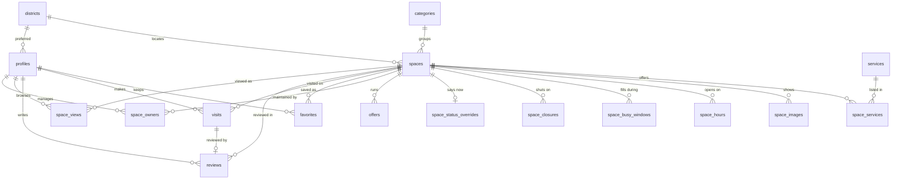

# The FOCUS SPACE database

PostgreSQL 15+ (written for Supabase). Four files, applied in order:

```
001_schema.sql      tables, types, constraints, indexes
002_functions.sql   availability, ratings, distance, the card view
003_policies.sql    row level security
004_seed.sql        the 21 spaces, generated from js/data.js
```

```bash
psql "$DATABASE_URL" -f 001_schema.sql -f 002_functions.sql -f 003_policies.sql -f 004_seed.sql
```

Everything parses against the real PostgreSQL parser, plpgsql bodies included.
Applied and verified on Supabase project `focus-space` (`ojixptqwxlxkmkowxkdy`,
eu-central-1): 21 tables, 37 policies, 21 spaces seeded, availability and
distance functions checked against known cases, and the Supabase security
linter clean of errors.

---

## What it stores, and why

The site invents three things today: ratings, live availability, and the
photographs. Those are the reasons this database exists, so the schema takes
each one seriously rather than storing a number somebody typed.



### People

| Table | Holds |
|---|---|
| `profiles` | A customer's public identity: display name and avatar. Anyone may read it, which is exactly why it holds nothing else — this is the name on a review. |
| `profile_private` | The same customer's email, phone, preferred district, language, theme and preferences. Readable only by that customer; not even staff. |
| `staff` | Membership is what "admin" means. Nothing else grants it, and nobody can add themselves. |

### Places

| Table | Holds |
|---|---|
| `districts` | Salmiya, Jabriya, Sharq… with governorate and a centre point averaged from the spaces in them. |
| `categories` | Offices, Halls, Cafés — the `01/02/03` on screen is `position`. |
| `services` | The 18-service vocabulary: `wifi`, `projector`, `prayer`, `women`… |
| `spaces` | Name, description, address, `geography(Point)` location, capacity, hourly price, phone, booking link, publication status, timezone. |
| `space_services` | Which services each space offers. |
| `space_images` | Real photographs, ordered, one cover enforced by a partial unique index. |
| `space_hours` | One row per weekday it opens. `closes_next_day` carries a café that runs 16:00 → 02:00. |
| `space_busy_windows` | The hours it is reliably full, so a card can say Busy before someone drives there. |
| `space_closures` | Holidays, Ramadan hours, one-off shutdowns. |
| `space_status_overrides` | What the venue says *right now*, with an expiry so a stale "busy" cannot stick. |
| `offers` | Now dated — `starts_on` / `ends_on` — instead of a string that never expires. |
| `space_owners` | Who may edit a listing and flip its live status. |

### What people do

| Table | Holds |
|---|---|
| `favorites` | The heart on a card. |
| `space_views` | Browsing history behind "Recently viewed". |
| `visits` | An actual visit: date, arrival and departure, party size, purpose (`study`, `work`, `meeting`, `course`, `event`), notes. This is "the places each customer visits". |
| `reviews` | One per person per space, 1–5 plus a body, optionally tied to the visit it came from. |

### Operations

| Table | Holds |
|---|---|
| `contact_messages` | The Contact Us form, which currently discards what people write. |
| `space_suggestions` | "I'd like my space listed", before it becomes a listing. |

---

## The decisions worth knowing

**Bilingual text is `jsonb`, not a translations table.** Every human-facing
string is `{"en": "...", "ar": "..."}` behind an `i18n_text` domain that
requires English. It matches the front end one-to-one, and one row is one
space in both languages. A third language would still fit; a fourth or fifth
would be the moment to normalise into `space_translations`.

**Ratings are derived, never written.** `spaces.rating_avg` and
`review_count` are maintained by a trigger over published reviews. The
column carries a comment saying so. This is the honest version of the 4.9
the site shows today.

**Availability is a function, not a column.** `space_availability(space, at)`
resolves closure → opening hours → the venue's own live override → the usual
rush, in the space's own timezone. It is the same rule the browser applies
today, moved somewhere it can be trusted and queried.

**Location is PostGIS.** `spaces_near(lat, lng, radius_km)` orders by real
distance against a GiST index, instead of the browser downloading every
space and sorting them itself. That is the difference between 21 spaces and
5,000.

**Search is indexed.** A generated `search_doc` tsvector covers the English
and Arabic name, description and address, with a trigram index on the name
for fuzzy matches.

**Row level security assumes the client is hostile.** Listings are public;
favorites, visits, views and contact details are readable only by their
owner; a venue's own rows are writable only by its owners or staff; anyone
may write a contact message and nobody but staff may read one.

**Contact details live in their own table.** A review needs an author's name,
so `profiles` is public — and therefore holds only a display name and an
avatar. Email, phone and preferences sit in `profile_private`, which no
policy opens to anyone but its owner. Publishing a review can never publish
a phone number, and no privileged view is needed to make that true.

**The visitor's location is deliberately not stored.** It is asked for on tap,
used to sort, and forgotten. Storing coordinates turns a permission prompt
into a privacy commitment the product does not need.

---

## Queries the interface actually makes

```sql
-- the space grid, already carrying status, services, cover and offers
select * from space_cards order by rating_avg desc nulls last;

-- available right now, seats twelve, has a projector
select c.* from space_cards c
 where c.availability = 'available'
   and c.capacity >= 12
   and 'projector' = any(c.services);

-- nearest to the visitor
select c.*, n.distance_km
  from spaces_near(29.3759, 47.9774, 25) n
  join space_cards c on c.id = n.space_id
 order by n.distance_km;

-- search, both languages at once
select * from space_cards
 where id in (select id from spaces
               where search_doc @@ websearch_to_tsquery('simple', 'quiet Salmiya'));

-- one customer's history
select s.name->>'en' as space, v.visited_on, v.purpose, r.rating
  from visits v
  join spaces s on s.id = v.space_id
  left join reviews r on r.visit_id = v.id
 where v.user_id = auth.uid()
 order by v.visited_on desc;
```

## Regenerating the seed

`004_seed.sql` is generated, so the database and the app cannot drift:

```bash
node focus-space/db/generate-seed.mjs > focus-space/db/004_seed.sql
```

It reads `js/data.js` directly. Once the database is the source of truth,
retire the generator and let `data.js` fetch instead.

## Before going live

- **The 21 spaces are illustrative.** Real venues need their own permission
  before their name, photograph and hours are published.
- **`space_cards` calls `space_availability` per row.** Fine into the
  thousands; past that, cache the state on the row and refresh it on a
  schedule.
- **Not on Supabase?** Drop the `references auth.users(id)` on
  `profiles.id` and manage identities yourself; `auth.uid()` in the policies
  then needs an equivalent.
